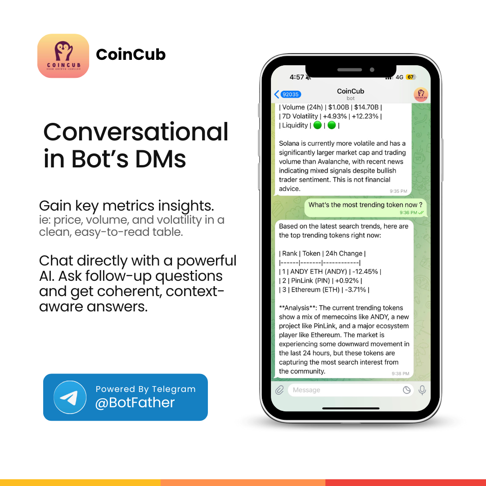
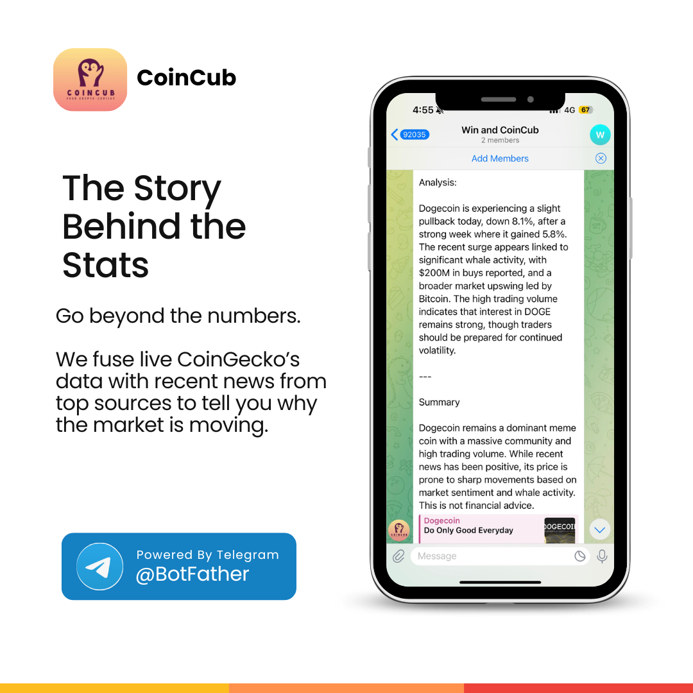
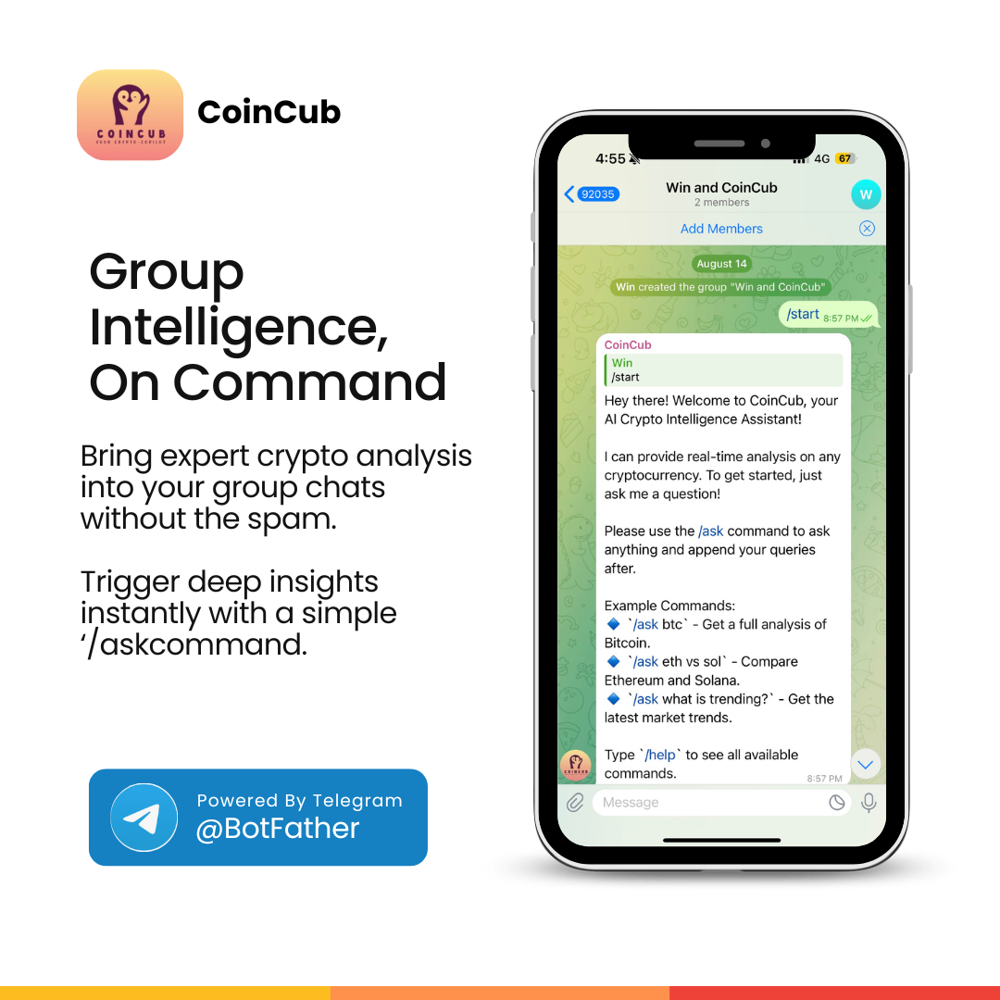
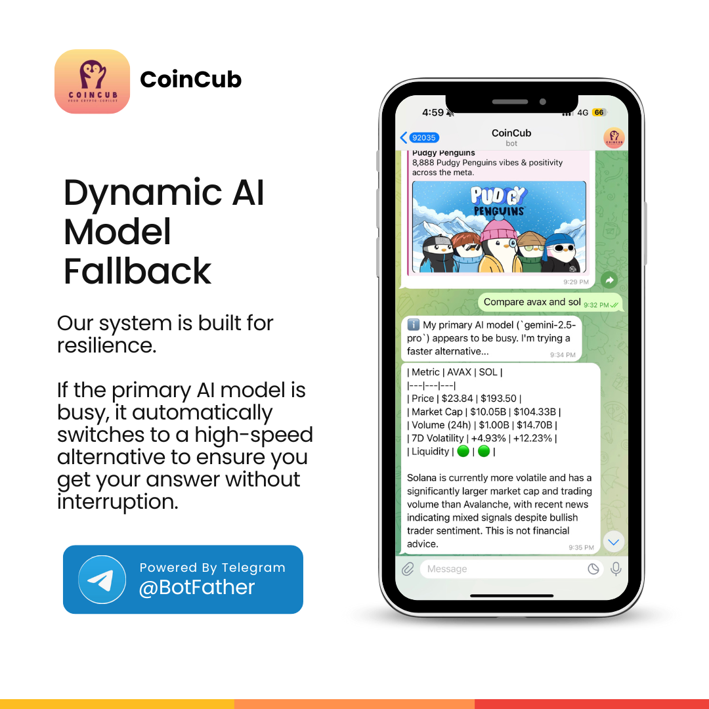

# CoinCub - Your Intelligent Crypto Agent (LLM + MCP Tooling Integration)

<p align="center">
</p>

<p align="center">
  
</p>

CoinCub is a sophisticated Telegram-based **AI crypto agent** built for **NullShot Hacks: Season 0 (Track 2)**. Powered by **Google Gemini AI** and connected to a live **CoinGecko MCP Server**, CoinCub provides real-time token analysis, comparisons, and conversational insights directly inside Telegram using an agentic workflow powered by MCP.

*This project was developed for **NullShot Hacks: Season 0 — Track 2 (MCPs/Agents using other frameworks)**.*

<p align="center" style="white-space: nowrap; overflow-x: auto;">
  
  
  
</p>

<p align="center" style="white-space: nowrap; overflow-x: auto;">
  
  
</p>

## Features

- **Single Token Analysis:** Get a full overview of any cryptocurrency including price, market cap, volume, volatility, and liquidity using live MCP data.
- **Dual Token Comparison:** Compare two tokens side-by-side with a clean, formatted Markdown table.
- **Dynamic AI Model Fallback:** Automatically switches to a secondary AI model if the primary one is busy or unavailable.
- **Real-Time News Integration:** Fetches the latest headlines from top crypto news sources for agent-driven context.
- **Conversational AI Agent:** Ask general questions or follow-ups with context-aware memory.
- **Automated Risk Assessment:** Automatically flags low liquidity, low volume, and high volatility.
- **Intelligent Intent-Driven:** Understands various user intents from simple price checks to complex risk analysis.

## Tech Stack

- **Backend:** Python 3.10+
- **Telegram Framework:** `python-telegram-bot` (v20+)
- **AI & Language Model:** Google Gemini via the official CLI
- **MCP Server:** CoinGecko MCP (Live Market Data Provider)
- **News Feeds:** RSS from CoinDesk, CoinTelegraph, Decrypt
- **Concurrency:** `asyncio`

## Getting Started

Follow these instructions to get a local copy up and running.

### Prerequisites

- Python 3.10 or higher
- A Telegram Bot Token from [@BotFather](https://t.me/BotFather)
- An environment with the Gemini CLI configured and authenticated, Google Gemini API Key from [Google AI Studio](https://aistudio.google.com/app/apikey)
- RSS Feed URLs (optional but recommended)

### Installation & Running

1.  **Set up the Google Gemini CLI:**
    -   This project requires the Gemini command-line tool to be installed and authenticated with your Google AI API key.
    -   **Please follow the official instructions here to set it up:**  
        https://github.com/google-gemini/gemini-cli/blob/main/README.md
    ```sh
    npm install -g @google/gemini-cli
    ```

2.  **Clone the repository:**
    ```sh
    git clone https://github.com/DevDiner/CoinCub.git
    cd cryptocopilot
    ```

3.  **Create and activate a virtual environment (recommended):**
    ```sh
    python3 -m venv venv
    source venv/bin/activate
    ```

4.  **Install the required dependencies:**
    ```sh
    pip install -r requirements.txt
    ```

5.  **Set up your environment variables:**
    -   Copy the example `.env.example` file to a new `.env` file:
        ```sh
        cp .env.example .env
        ```
    -   Open the `.env` file and fill in your actual API keys and tokens.

6.  **Run the bot:**
    ```sh
    python telegram_bot.py
    ```
    The agent will start listening for messages.

## Environment Variables

To run this project, you will need to add the following environment variables to your `.env` file:

- `COINCUB_BOT_TOKEN=` (Telegram bot token)
- `RSS_COINDESK=` (Full URL for CoinDesk RSS feed)
- `RSS_COINTELEGRAPH=` (Full URL for CoinTelegraph RSS feed)
- `RSS_DECRYPT=` (Full URL for Decrypt RSS feed)

## Prompt Engineering

A key component of CoinCub is the detailed system prompt located in `prompt/GEMINI.md`. This file acts as the agent's **constitution**, defining its personality, MCP tool access, reasoning logic, and response formats. This allows for rapid iteration on agent behavior without changing the core Python code.

## Hackathon Submission

This project is a submission for **NullShot Hacks: Season 0 — Track 2 (MCPs / Agents using other frameworks)**. It demonstrates how **LLM-powered agents connected via MCP servers** can autonomously reason, fetch real-time financial data, and operate as intelligent crypto research assistants inside messaging platforms.

---
